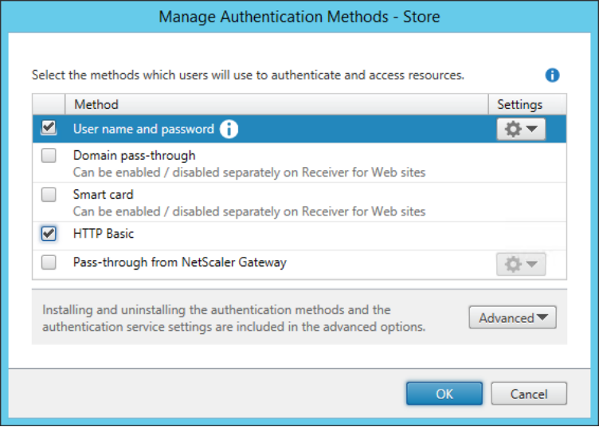

# Storebrowse Classic Password Insertion for StoreFront [Citrix Workspace app 1808 for Linux]

## Introduction

This document describes the way storebrowse is intended to be used when taking advantage of the new SSO capabilities available in Citrix Workspace app for Linux.

## Configuration

To enable domain credentials insertion, enable the HTTP Basic authentication method in the StoreFront console:

## Operations with Credential Insertion

Storebrowse allows credentials to be provided for authenticating to a StoreFront server using the same `-U`/`-D`/`-P` switches used for presenting username, and domain and password, respectively, to a PNA store.

The set of credentials used with StoreFront servers is stored into Authentication Manager’s (AM) Single Sign-On (SSO) cache because AM is in charge of the authentication process when connecting to StoreFront sites.

The credentials stored in the SSO container are shared among storebrowse calls as long as they are not removed from the cache or as long as AM is running (that is, terminating AM would also clear the credential cache).

This means that after a set of credentials is inserted in SSO, it can be omitted in any subsequent usage of storebrowse that requires that same set of credentials.

However, specifying the same credentials during subsequent storebrowse calls does not result in an overflow in the credential container because subsequent insertion attempts are ignored as per the rules enforced when comparing credentials (for reference, see the following section about credential comparison rules).

For examples on how to use the `-U`/`-D`/`-P` switches to provide SSO credentials, see the Linux OEM Reference Guide.

## Domain credential comparison rules

Storebrowse allows only domain credentials to be presented. The command line is not considered secure enough to provide smart card PINs.

After a set of credentials is inserted, the SSO implementation in AM allows for a second set of credentials to be inserted on top of the first one, provided that the second set is different. That means that at most two separate sets of credentials can be stored at the same time (that is, only a single level of restore is supported). 

The credentials are cached in SSO in a stack fashion, with only the topmost set of credentials accessible for authentication.

When inserting a set of credentials into SSO, it is compared to those already available in the container (if any).

If the comparison is positive, the new credentials are ignored and not cached.
If the comparison is negative, the new credentials are stored on top of the currently stored credentials (if the second slot is empty).

The rule enforced to compare domain credentials is as follows: two sets of domain credentials are considered matching if username and domain are equal (the password is ignored in the comparison).

### Examples

* `-U usernameA -D domainA -P passwordA == -U usernameA -D domainA -P passwordA`  Credentials match: all three fields match.
* `-U usernameA -D domainA -P passwordA != -U usernameB -D domainA -P passwordA`   Credentials do not match: the username different.
* `-U usernameA -D domainA -P passwordA != -U usernameA -D domainB -P passwordA`  Credentials do not match: the domain different.
* `-U usernameA -D domainA -P passwordA == -U usernameA -D domainA -P passwordB`  
Credentials match: only the password is different.

## Examples

The following examples illustrate how to use the Citrix Workspace app's SSO capabilities with storebrowse.

### Basic usage flow

A store is added, its apps/desktops enumerated, an app/desktop is launched, then the store is removed. The credentials are cached at the beginning of the flow and then reused for all subsequent operations. Some operations are performed passing the same credentials again to demonstrate that it does not affect the status of the SSO cache.

| Sl. no. | Activity | Command | Output |
|---|---|---|---|
| 1. | No stores, no credentials cached | NA | NA |
| 2. | List stores | `storebrowse -l` | none, no stores listed |
| 3. | Add a store and provide credentials | `storebrowse -U username -D domain -P password -a storefrontURL` | none, the operation succeeded | 
| 4. |	List stores | `storebrowse -l` | `fullstorefrontURL` |
| 5. | Enumerate the apps/desktops passing the same credentials as before | `storebrowse -U username -D domain -P password -E fullstorefrontURL` | 
list of apps/desktops (the given credentials are ignored, the SSO cached credentials are used) |
| 6. | Enumerate the apps/desktops without specifying credentials | `storebrowse -E fullstorefrontURL` | list of apps/desktops (the SSO cached credentials are used) |
| 7. | Launch an app/desktop passing the same credentials as before | `storebrowse -U username -D domain -P password -L appordesktopname fullstorefrontURL` | the app/desktop launches (the given credentials are ignored, the SSO cached credentials are used) |
| 8. | Launch an app/desktop without specifying credentials | `storebrowse -L appordesktopname fullstorefrontURL` | the app/desktop launches (the SSO cached credentials are used) | 
| 9. | Remove the store | `storebrowse -d fullstorefrontURL` | none, the operation succeeded | 
| 10.| Remove the cached credentials from the SSO cache | `storebrowse -K` | none, the operation succeeded |
| 11. | List stores | `storebrowse -l` | none, no stores listed |

### User restore flow

A user is logged on, his/her apps/desktops are enumerated, one of the apps/desktops is launched.

Then another user is logged on in addition to the previous one, the new user’s apps/desktops are enumerated, one of the new user’s apps/desktops is launched.

The second user is logged off.

The first user’s apps/desktops are enumerated again, one of the first user’s apps/desktops is launched again.

The first user is then logged off.

| Sl. no. | Activity | Command | Output |
|---|---|---|---|
| 1. | No stores, no credentials cached | NA | NA |
| 2. | List stores | `storebrowse -l` | none, no stores listed |
| 3. | 1.	StoreFront A is added for User A, User A’s credentials are cached
 | `storebrowse -U usernameA -D domainA -P passwordA -a storefrontURLA` | none, the operation succeeded | 
| 4. |	List stores | `storebrowse -l` | `fullstorefrontURL` |
| 5. | Enumerate User A’s apps/desktops without specifying credentials | `storebrowse -E fullstorefrontURLA` | 
list of apps/desktops (the SSO cached credentials are used) |
| 6. | Launch a User A’s app/desktop without specifying credentials | `storebrowse -L appordesktopnameA fullstorefrontURLA` | the app/desktop launches (the SSO cached credentials are used) |
| 7. | User B logs on in addition to User A, StoreFront B is added for User B, User B’s credentials are cached on top of User A’s | `storebrowse -U usernameB -D domainB -P passwordB -a storefrontURLB` | none, the operation succeeded |
| 8. | List stores | `storebrowse -l`  | `fullstorefrontURLA fullstorefrontURLB` | 
| 9. | Enumerate User B’s apps/desktops without specifying credentials | `storebrowse -E fullstorefrontURLB` | list of apps/desktops (the latest/topmost SSO cached credentials are used) | 
| 10.| Launch a User B’s app/desktop without specifying credentials | `storebrowse -L appordesktopnameB fullstorefrontURLB` | the app/desktop launches (the latest/topmost SSO cached credentials are used) |
| 11. | User B logs off, their store is removed | `storebrowse -d fullstorefrontURLB` | none, the operation succeeded |
| 12. | Remove the cached credentials for User B from the SSO cache | `storebrowse -K` | none, the operation succeeded (the latest/topmost credentials are removed from the SSO cache) | 
| 13. | List stores | `storebrowse -l` | `fullstorefrontURLA` |
| 14. | Enumerate User A’s apps/desktops without specifying credentials | `storebrowse -E` | `fullstorefrontURLA` | list of apps/desktops (the previous SSO cached credentials are used) |
| 15. | Launch a User A’s app/desktop without specifying credentials | `storebrowse -L appordesktopnameA fullstorefrontURLA` | the app/desktop launches (the previous SSO cached credentials are used) |
| 16. | User A logs off, the configured store is removed | `storebrowse -d fullstorefrontURLA` | none, the operation succeeded |
| 17. | Remove the cached credentials for User A from the SSO cache | `storebrowse -K` | none, the operation succeeded (the previous credentials are removed from the SSO cache, now empty) |
| 18. | List stores | `storebrowse -l` | none, no stores listed |
| 19. | The system is back to its starting state | NA | NA |

